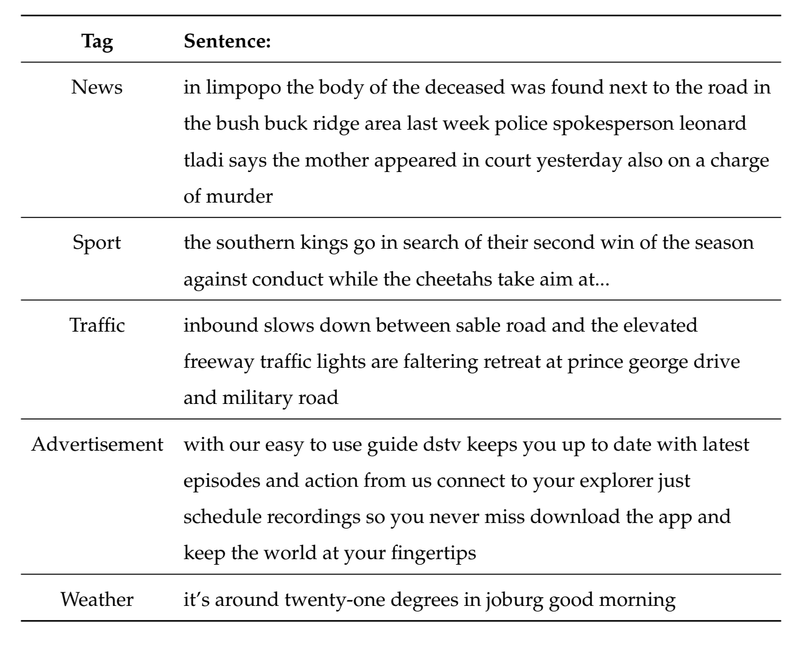
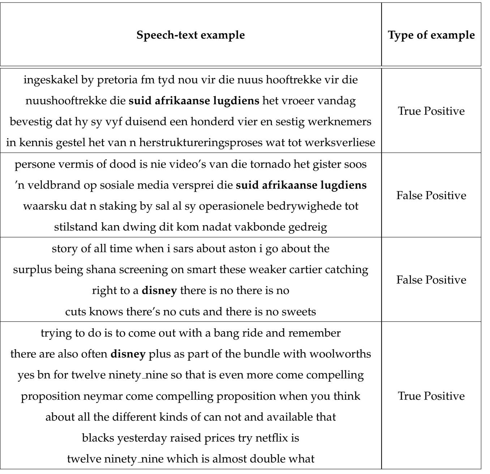
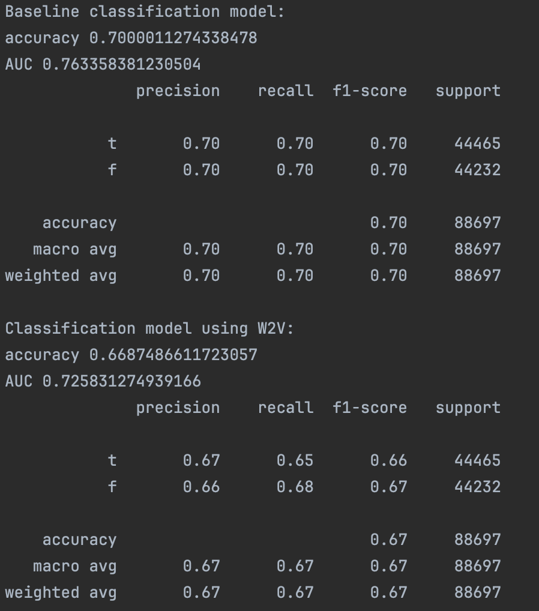

# Using Logistic Classification for Pre-trained Word Embedding

Please follow the instructions below.

## Installation

For installation to work as expect please insure you are running `python=3.9` on your local machine before creating the virtual environment.
#### Create a virtual environment:

```bash
python3 -m venv venv
```

#### Activate virtual environment:

```bash
source venv/bin/activate
```

#### To deactivate:

```bash
(venv) deactivate
```


#### Install environment dependencies:

Before running the application, ensure that you have Streamlit installed. If not, you can install it using pip:

```bash
pip install -r requirements.txt
```

## Overview
This script classifies sentences into categories using logistic regression. It supports two modes:

1. Classification using pre-trained word embeddings.
2. A baseline classification using TF-IDF vectors.

## Input File Format:

The input CSV file should contain two columns:

* `Sentence`: The text of the sentence.
* `Tag`: The category label of the sentence.

Example of a valid CSV input file (classification_dataset_example.csv):

```shell bash
Sentence,Tag
"This is an example sentence.",news
"Another example sentence.",sport
"Another example sentence.",weather       
"Another example sentence.",advertisement       
"Another example sentence.",traffic      
```

## Usage Instructions
Classify Using Both Pre-trained Word Embeddings and the Baseline Classifier

```shell bash 
python classify_word_vectors.py --inFilePath <path_to_input_csv> --inModelPath <path_to_word_embedding_model> --outFileName <output_file_name> --baseLine 1
```

* `<path_to_input_csv>`: The path to the input CSV file.
* `<path_to_word_embedding_model>`: The path to the pre-trained word embedding model.
* `<output_file_name>`: The name of the file where the classification report will be saved.

## Example:

```shell bash
python classify_word_vectors.py --inFilePath English_tagged.csv --inModelPath ./word2vec_models/word2vec_train_epochs_trained_10_English_CBOW_embedding_size_300 --outFileName classification_report.txt --baseLine 1
```
## Classify Using Only Pre-trained Word Embeddings:

```shell bash
python classify_word_vectors.py --inFilePath <path_to_input_csv> --inModelPath <path_to_word_embedding_model> --outFileName <output_file_name>
```

Use the same parameter values as described above. Omit the `--baseLine` flag to skip baseline classification.

## Example:
```shell bash
python classify_word_vectors.py --inFilePath English_tagged.csv --inModelPath ./embedding_models/word2vec_train_epochs_trained_10_English_CBOW_embedding_size_300 --outFileName classification_report.txt
```

This README aims to provide clear instructions on how to use the script for classifying sentences into predefined categories using logistic regression and pre-trained word embeddings.

## Description of dataset used for testing embeddings

### News classifier dataset:


The dataset, sourced from the media-monitoring organization Novus Group (https://novusgroup.co.za/), 
comprises recordings from 106 diverse South African radio and television stations, 
featuring 12 different languages: English, Afrikaans, isiZulu, isiXhosa, Sesotho, Tshivenda, Sepedi, Siswati, Setswana, Ndebele, xiTsonga, and Hindi.

To assemble an exclusive corpus of English sentences, a Language Identifier (LID) was deployed to discern the language of each sentence.
Those identified as English were incorporated into the code-switched dataset. For this purpose, the FastText model for language identification was employed.
Subsequently, the examples were categorized into one of five distinct categories: sports data, news data, advertisements, traffic reports, and weather data. 
This curated and processed collection forms a standalone dataset, which we used here.


Examples of sentences in the dataset tagged with their appropriate categories:
<p float="left">
  
</p>

### False positive identification dataset:
The speech-text data were collected from local South African broadcasting stations and consist of an amalgamation of 
radio news and television channel data. This collection was obtained from the output of a single 
Automatic Speech Recognition (ASR) system capable of recognizing all 12 South African languages. 
The data retrieved from the system were manually labeled to indicate False Positives (FPs) by individuals working for the Novus Group. 

Example snippet of the data:
<p float="left">
  
</p>


## Classification results:

The results from the classification of news and FP (False Positive) can be found in the ./classification directory. 
The baseline classifier employs TF-IDF for creating sentence feature representations. Further help for interpreting the report can be found on: https://scikit-learn.org/stable/modules/generated/sklearn.metrics.classification_report.html.

<p float="left">
  
</p>

### False positive identification results:

In this instance, fastText's continuous bag of words (CBOW) model serves as the embedding technique for sentences. We achieve an Area Under the Curve (AUC) exceeding 70% across all classes. It's important to highlight, though, the presence of a significant class imbalance between the "t" (true) and "f" (false) categories. Techniques like undersampling could be applied to rectify this imbalance.
<p float="left">
  
</p>

### News classifier results:
This example demonstrates the use of word2vec (SG) as an embedding method for sentences. As illustrated in the image below, using this method achieves a weighted F1-score above 70% between the different classes.
<p float="left">
  
</p>
